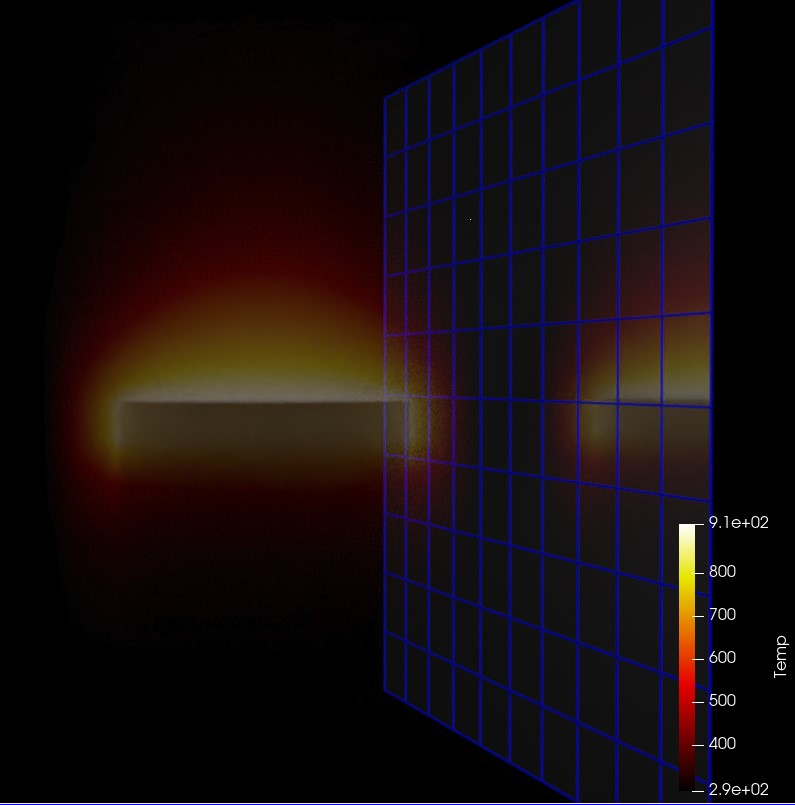
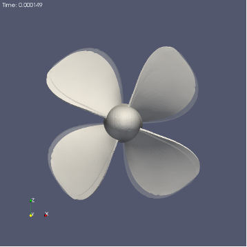

ParaView 5.9.0 Release Notes
============================

Major changes made since ParaView 5.8.0 are listed in this document. The full list of issues addressed by this release is available
[here](https://gitlab.kitware.com/paraview/paraview/-/milestones/14).

* [New features](#new-features)
* [Rendering enhancements](#rendering-enhancements)
* [Filter changes](#filter-changes)
* [Readers, writers, and sources changes](#readers-writers-and-sources-changes)
* [Interface improvements](#interface-improvements)
* [Python scripting improvements](#python-scripting-improvements)
* [Miscellaneous bug fixes](#miscellaneous-bug-fixes)
* [Catalyst](#catalyst)
* [Developer notes](#developer-notes)

# New features

# Rendering enhancements

## Ray tracing updates

ParaView 5.9’s version of Intel OSPRay has been updated from 1.8 to 2.4 and NVIDIA’s visRTX has been updated accordingly. OSPRay version 2 consolidates volume sampling responsibilities to the new OpenVKL thread and SIMD accelerated “volume kernel library” library. The most visible change to ParaView users from this upgrade is the addition of volume rendering to the OSPRay path tracer backend. In a path tracing context, volumes can emit and receive lighting effects to and from the rest of the scene. This can bring about a new level of realism when used carefully.

>
>`Example dataset volume rendered in OSPRay path tracer and a mirror wall

The second most visible ray tracing update in ParaView 5.9 is likely the inclusion of Marston Conti’s expanded set of path tracer materials.

>
> Example dataset with concrete and cast chromium materials.

There are smaller but still notable ray tracing updates and bug fixes in this release as well.
*	`vtkMolecule` data, for example that generated when ParaView loads protein data bank (.pdb) files, are now drawn.
*	ray caster now supports gradient backgrounds, path tracer now supports backplate and environmental backgrounds (independently or simultaneously)
*	streamlines and line segments generally are smoother and have rounded ends.
*	there are two new sizing modes that exactly control the size of implicitly rendered spheres (for points) and cylinders (for lines). Choose “All Exact” to make the “Point Size” or “Line Width” be the world space radius or “Each Exact” to take radii from a designated point aligned array. “All Approximate” and “Each Scaled” are the legacy behaviors where the radius depends on object bounds or maps a point aligned array though a transfer function.
*	Kitware’s 5.9 Linux ParaView binaries now include OSPRay’s module_mpi which supports image space parallelism over cluster nodes to accelerate ray traced rendering of moderately sized scenes. To use it spawn one ParaView and any number of ospray_module_workers in a heterogenous MPI run, supplying the ParaView rank with `OSPRAY_LOAD_MODULES=mpi` and `OSPRAY_DEVICE=mpiOffload` environment variables. OSPRay render times will be sped up roughly in proportion to the number of workers when rendering is a bottleneck.

# Filter changes

# Readers, writers, and source changes

# Interface improvements

## About Dialog Improvements

We introduced several improvements to the *About* dialog:

 * The version of VTK is now printed - it prints the full git tag if available.
 * A "Save to File..." and "Copy to Clipboard" button have been added to export the information.

# Python scripting improvements

# Miscellaneious bug fixes

# Catalyst

## Catalyst Intel® Optane™ Persistent Memory update

Catalyst in ParaView 5.9 with legacy Catalyst scripts gained experimental support for new temporal processing of simulation generated data. Now simulation outputs/Catalyst inputs can be marked as temporal sources and given a fixed size caching window. Temporal filters, for example **Temporal Statistics** and **Temporal Interpolator** will then function within a Catalyst run. With careful scripting, after the fact "ex post facto" triggers can be applied that react to events and take into account information from earlier simulation timesteps. The size of the cache (and potentially any `vtkDataObject`) can even exceed DRAM capacity, into the file system for example or more efficiently into Optane™ App Direct spaces if one builds in ParaView’s new optional dependency on the memkind library. For details see the `TemporalCacheExample` in the source code, the memkind VTK level tests, and catch the related lightning talk at the ISAV workshop at IEEE SC 20 for details.

>
> OpenFOAM propeller tutorial, interpolated toward the next timestep for smoother animation via in situ temporal caching.

# Developer notes
