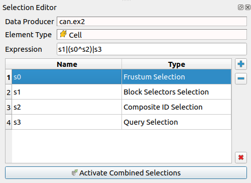

## Add Selection Editor

`Selection Editor` is a new panel that allows saving and combining many selections of different types using a boolean
expression.

`Selection Editor` has:

1. `Data producer` field that is set based on the source of the active selection.
    1. If the source of the active selection changes, the Data producer will change as well, and any saved selection
       will be deleted.
2. `Element type` field that is set based on the element type of the active selection.
    1. If a selection is saved and a new active selection is made that has a different element type, the user will be
       prompted to decide if he wants to change the element type to add the new active selection. Doing so will result
       in deleting the saved selection.
3. `Expression` string that is set by the user, and it is also automatically filled while adding new selections.
4. `Saved Selections` table that lists the name, which is used to define the expression, and the type of the selection.
    1. If the user selects a selection from the `Saved Selections` table, and the active view is a render-view, the
       selected selection will be interactively shown. Deselecting the selected selection hides the selected selection
       from the render-view.
5. `Add Active Selection` button that adds the active selection to the list of saved selections.
6. `Remove Selected Selection` button that removes the selected saved selection from the list of saved selections.
7. `Remove All Selections` button that removes all saved selections from the list of saved selections.
8. `Activate Combined Selections` button that sets the combined saved selections as the active selection.

An example of a combined selection created using the selection editor is shown below.

To accommodate the creation of the `Selection Editor` panel, the following changes were also completed:

1. `SelectionQuerySource` now is implemented using `vtkSelectionSource`. `vtkQuerySelectionSource` has been removed
   since it's no longer needed.
2. `AppendSelections` filter proxy has been created using `vtkAppendSelection` to combine many selections of different
   types using a boolean expression.
3. Every view (render/context/spreadsheet) and the FindDataWidget now generate a `AppendSelections` proxy. Due to this
   change, the render view can now combine all selections types including frustum-based selections. `Show frustum`
   button has been removed, because 1) it's not used, 2) and visualizing more than one frustum would be highly confusing
   for the user.
4. `vtkSelectionConverter` has been deleted because it's no longer used.
