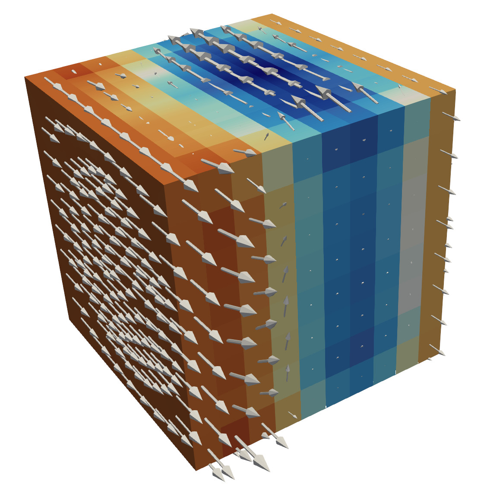

## Significant Cell Grid Improvements

Cell grids – which are an extensible new type of data in VTK – now have
an IOSS-based reader; hardware selection; CPU- and GPU-based interpolation
using the same source code; and several new and improved filters.

The example rendering below shows how discontinuities at cell boundaries
are allowed while simultaneously supporting spatial variation within each
cell (unlike traditional VTK cell-data). You can see both smooth and sharp
variations
in [this example mesh](https://www.paraview.org/files/ExternalData/SHA512/4f4fa78c414c8093721a9ff2dea1c4d7fb6fbf1e67c960edc76160544338650f5cd513231b6bd5aba2e80be68f5832eeff555c0df59279856be1dc6bb64de90a),
colored by the Z component of the magnetic field variable (`FACE_COEFF_B_Field`)
at time-step 2.

> 

The arrow glyphs show the overall magnetic field directions.
The field itself is stored as a single coefficient per hexahedral face
with a vector-valued Thomas-Raviart basis function. This, too, was previously
unsupported by VTK.

To read more about these changes, please see
[this topic](https://discourse.vtk.org/t/new-vtkcellgrid-functionality/14640)
on VTK's discourse forum.
