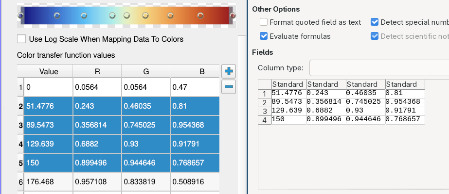

## Copy tables to clipboard

ParaView shows different properties as table, like **IsoSurfaces** from the **Contour** filter
or the color transfer function values (**RGBPoints**).
You can now copy their content to the clipboard, using the standard shortcut (usually `ctrl+c`).

> 
>
> Right, copy table rows. Left, paste them in another software
